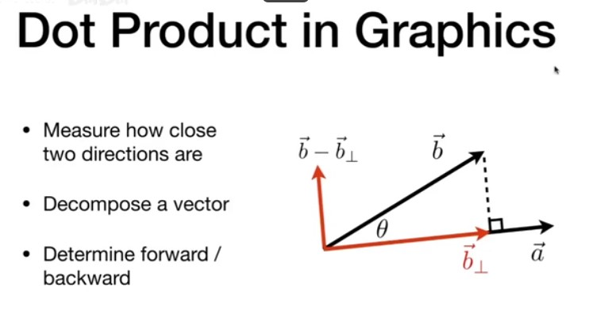
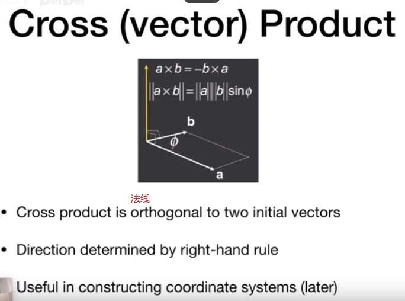
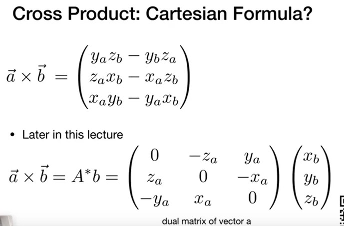

# A Swift and Brutal Introduction to Linear Algebra
波动光学的研究

走样 - 反走样技术 - signal processing
有限元问题

aesthetics - 美学

Cartesian Coordinate - 笛卡尔坐标

数学上叫向量，物理上叫矢量， 表示一个方向。$\vec{a}$ 两个属性: 
   - 方向
   - 长度

平移向量向量不变。 

向量的长度： Magnitude(length) of a vector, 向量的模 $\parallel \vec{a} \parallel $

单位向量 Unit Vector $\hat a$, 用于表示方向

Vector Addition(向量加法):
    平行四边形法则和三角形法则
向量默认是列向量。
### Dot Product (Scalar) 

$\vec{a} \cdot \vec{b} = \Vert \vec {a} \Vert \Vert \vec {b} \Vert cos\theta $
应用场景:
  - Find angle between 2 vectors(光的方向,物体法线的方向和人看的角度)
  - Finding projection of one vector on another 光线导致物体A在物体B上的投影.

dot product > 0 or < 0 可以告诉我们2个向量的方向是相同的还是相反的, 也可以告诉我们两个向量有多接近. 方向向量的点乘结果从1 到-1. 
镜面反射

### Cross Product(Vector) - 向量的叉积

给定2个向量, 会给出另外一个向量, 叉积的结果和原来的两个向量都垂直. - 右手螺旋定则

### Cross product

向量叉乘不适用交换律，需要加上一个负号。
$\vec{a} \times \vec {b} = - \vec {b} \times \vec {a} $
$\vec{a} \times \vec {a} = \vec 0 $ 得到的是一个向量，向量的长度是0.
分配律和结合律任然适用：
$\vec{a} \times (\vec {b}  + \vec {c}) = \vec {a} \times \vec {b} + \vec {a} \times \vec {c} $
$\vec{a} \times (k\vec {b}) = k(\vec {a} \times \vec {b}) $

叉乘在图形学中的应用:
- Determine left /right
  两个向量$\vec a$, $\vec b$, 如何判断$\vec b$在$\vec a$的左侧还是右侧？ 
$\vec a \times \vec b$的结果如果是正的，则说明在左侧，否则在右侧。 
- Determine inside /outside
判断点P是在三角形ABC的内侧还是外侧？ 
$\vec {AB} \times \vec {AP}$, $\vec {BC} \times \vec {BP}$, $\vec {CA} \times \vec {CP}$, 如果他们的值都为正，则说明P在三角形内。
忽略三角形三条边的顺序，则只要判断这个点一直在三条边的左边，或者右边就可以判断是否在三角形内。 
光栅化时要判断像素点是在三角形内部还是外部，如果是内部，则需要着色，外部不需要。 
corner case: 叉积是0， 这个自己说了算。
### Matrix
- Non-commutative
矩阵不服从交换律 - AB and BA are different in general. 

- 服从结合律和分配律 - Associative and distributive
   - (AB)C = A(BC)
   - A(B+C) = AB+ AC
   - (A+B)C = AC + BC

**转置**: transpose of a matrix
$(AB)^T = B^T A^T$
**单位矩阵** - Identity Matrix
**逆矩阵** - Inverse
  - $AA^{-1} = A^{-1}A = I$
  - $(AB)^{-1} = B^{-1}A^{-1}$

